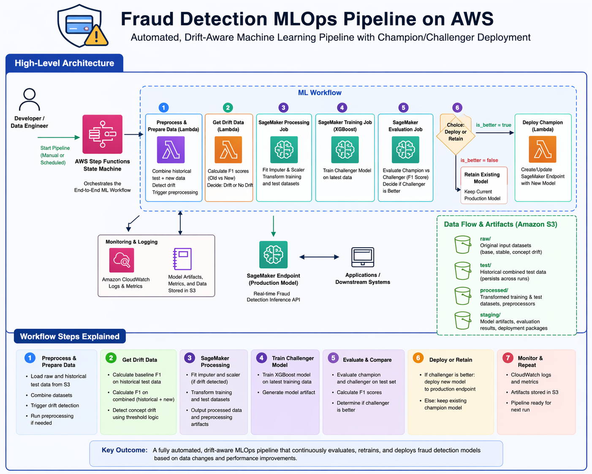
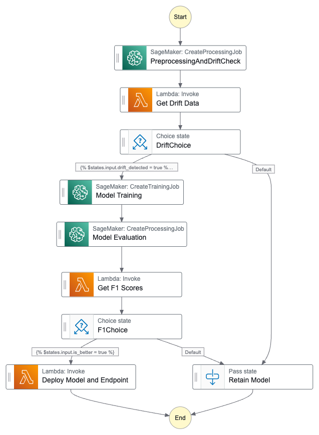
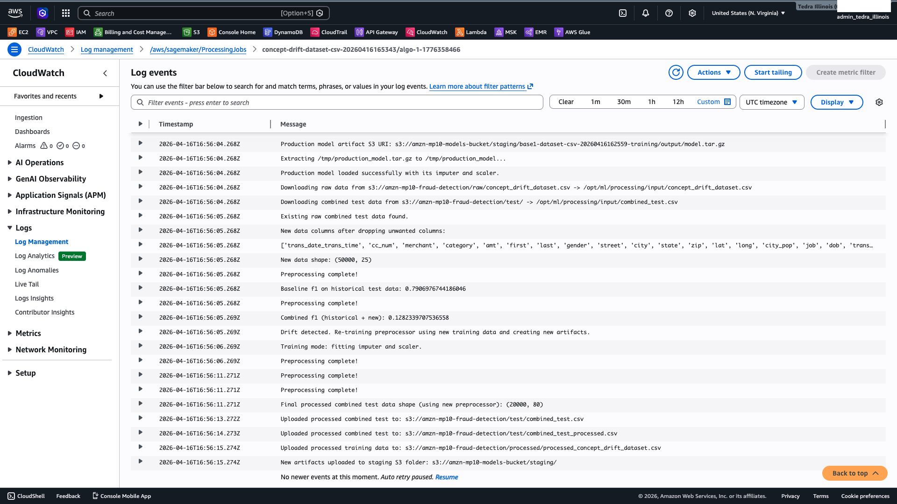
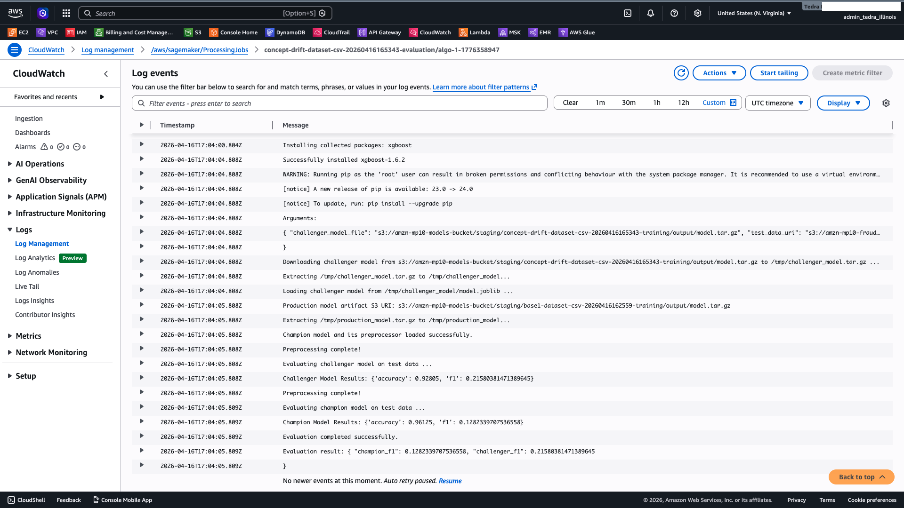

# 🚀 Fraud Detection MLOps Pipeline on AWS

🚀 Designed and implemented a production-style MLOps pipeline that automatically detects model drift, retrains models, and deploys improved versions using a fully serverless AWS architecture.

📊 Achieved up to 0.79 F1 score on baseline data and demonstrated performance degradation under concept drift, triggering automated retraining.

> End-to-end production-style machine learning pipeline with automated drift detection, retraining, and deployment using AWS.

> This architecture mirrors real-world ML systems used in fintech and large-scale platforms where continuous model adaptation is critical.

### 🔧 Built With
AWS Step Functions • SageMaker • Lambda • S3 • XGBoost • Python

## Overview
This project implements a production-style MLOps pipeline for fraud detection on AWS. It simulates a real-world system where machine learning models must continuously adapt to changing data distributions (concept drift). The pipeline automatically detects performance degradation, retrains models, and conditionally deploys improved models using a champion/challenger framework. The system integrates AWS Step Functions, Lambda, SageMaker, and S3 to orchestrate a fully automated, state-aware machine learning lifecycle.

---

## Problem Statement
Fraud detection systems must adapt to changing transaction behavior over time. This pipeline addresses that challenge by orchestrating automated model retraining and deployment decisions based on evaluation metrics and drift-aware workflow logic.

## ✨ Key Features

- ✅ Automated concept drift detection  
- ✅ Conditional model retraining pipeline  
- ✅ Champion/Challenger deployment strategy  
- ✅ Fully orchestrated ML workflow using Step Functions  
- ✅ Scalable cloud-native architecture (AWS)  

---

## 🏗️ Architecture Overview

The pipeline orchestrates:
- Data ingestion → preprocessing → drift detection  
- Conditional retraining using SageMaker  
- Champion/Challenger evaluation  
- Automated deployment decisions  

---

## ⚡ Pipeline Execution (Real Run)

### Step Functions Workflow

### Drift Detection Logs

### Model Evaluation Results

## Cloud Architecture Mapping

This project mirrors a production-style MLOps system using AWS:

### Data Layer (Amazon S3)
- raw/ → incoming datasets
- processed/ → feature-engineered data
- test/ → persistent combined test set for drift detection

### Model Layer (S3 + SageMaker)
- staging/ → model artifacts, evaluation results, preprocessing objects
- model.tar.gz → deployed model package

### Compute Layer
- AWS Step Functions → orchestrates workflow
- AWS Lambda → lightweight logic (drift + evaluation)
- SageMaker Processing → preprocessing + drift checks
- SageMaker Training → model training
- SageMaker Endpoint → real-time inference

### Observability
- CloudWatch logs used to debug pipeline across distributed services

## General Workflow
1. Raw transaction data is ingested into Amazon S3  
2. Step Functions orchestrates the end-to-end ML pipeline
3. SageMaker Processing performs feature engineering and drift checks  
4. Drift detection evaluates model performance degradation  
5. If drift is detected, SageMaker Training retrains a challenger model  
6. The challenger model is evaluated against the champion model  
7. The system conditionally deploys the best-performing model  

---

## ⚙️ System Workflow
1. Data Ingestion
- New transaction data is uploaded to S3 (raw/)

2. Preprocessing + Drift Detection
- SageMaker Processing job prepares features
- Drift is detected using F1 degradation threshold

3. Decision: Drift Detected?
- If NO → retain current model
- If YES → trigger retraining pipeline

4. Model Training (Challenger)
- Train new XGBoost model on updated dataset

5. Model Evaluation
- Compare challenger vs production (champion)

6. Champion/Challenger Selection
- If challenger performs better → deploy
- Otherwise → retain existing model

7. Deployment
- Best model is deployed to a SageMaker endpoint

---

## 🚨 Key Design Decisions

- **F1 Score as Primary Metric:**  
  Chosen due to class imbalance in fraud detection, balancing precision and recall.

- **Drift Threshold Selection (0.1):**  
  Tuned to balance sensitivity vs false positives in retraining triggers.

- **Champion/Challenger Strategy:**  
  Ensures only improved models are deployed, preventing regression.

- **S3-Based State Management:**  
  Enables persistence of historical test data for consistent evaluation.

---

## 🧰 Tech Stack

- Python
- AWS Step Functions
- AWS Lambda
- Amazon SageMaker
- Amazon S3
- XGBoost
- CloudWatch (logging & observability)

---

## Repository Structure

- `data/` – Raw and processed datasets
- `lambda/` – Lambda functions (drift detection, F1 evaluation)
- `sagemaker/` – Training, preprocessing, evaluation scripts
- `step_functions/` – State machine definitions
- `artifacts/` – Model artifacts and outputs
- `docs/` – Architecture diagrams, screenshots, design notes
- `dashboard/` – (future) monitoring tools
- `notebooks/` – Exploration and experimentation
- `tests/` – Unit/integration tests
- `README.md/` 

## 📊 Results & Model Performance

| Stage | F1 Score |
|------|--------|
| Initial Model (Base Dataset) | 0.79 |
| Stable Data (No Drift) | 0.76 |
| Concept Drift Dataset | 0.12 |
| Retrained Model | 0.21 |

**Key Outcomes:**
- Successfully detected concept drift  
- Triggered automated retraining pipeline  
- Improved model performance before deployment  
- Validated champion/challenger selection logic  

## Key Engineering Challenges & Solutions

### 1. Stateful Data Pipeline Bugs (S3 Persistence)
**Problem:**  
Pipeline produced inconsistent results due to residual test data (`combined_test.csv`) persisting across runs.

**Impact:**  
- Incorrect baseline F1 scores  
- False drift detection  
- Output inconsistencies  

**Solution:**  
- Identified hidden state in S3 `/test/` and `/processed/` prefixes  
- Implemented controlled environment resets  
- Designed pipeline awareness of historical vs fresh runs  

---

### 2. Drift Detection Sensitivity Tuning
**Problem:**  
Changing drift threshold from `0.1 → 0.05` caused incorrect drift behavior.

**Impact:**  
- False positives in drift detection  
- Incorrect model retraining decisions  

**Solution:**  
- Restored threshold to `baseline_f1 - 0.1`  
- Validated using controlled dataset scenarios  
- Ensured alignment with evaluation expectations  

---

### 3. Champion/Challenger Evaluation Consistency
**Problem:**  
Mismatch between historical and current F1 scores.

**Impact:**  
- Incorrect deployment decisions  
- Pipeline logic inconsistencies  

**Solution:**  
- Ensured `old_test_set_f1` correctly persisted across runs  
- Fixed evaluation flow in Step Functions  
- Verified metric consistency across preprocessing + evaluation stages  

---

### 4. End-to-End Pipeline Debugging Across Services
**Problem:**  
Failures required tracing across:
- Lambda
- Step Functions
- SageMaker
- S3
- CloudWatch

**Solution:**  
- Used CloudWatch logs to trace data flow across services  
- Validated intermediate artifacts (S3 + logs)  
- Debugged distributed system behavior  

## Why This Project Matters

This project demonstrates real-world machine learning engineering skills, including:

- Designing and orchestrating distributed ML systems  
- Managing stateful data pipelines in cloud environments  
- Implementing automated model retraining and deployment logic  
- Debugging cross-service failures in AWS (Lambda, Step Functions, SageMaker, S3)  
- Applying ML concepts (F1 score, concept drift) in production-like workflows  

Unlike typical ML projects, this system focuses on the full lifecycle of machine learning in production, not just model training.

## Future Improvements
- FastAPI inference layer
- Streamlit monitoring dashboard
- GitHub Actions CI/CD
- SNS alerts for drift and failed deployments
- Model registry integration

## ⚙️ How to Run

1. Upload dataset to S3 under the `raw/` prefix  
2. Trigger the Step Functions workflow  
3. Monitor execution via AWS Console / CloudWatch logs  
4. Review outputs in the `staging/` S3 bucket  
5. Validate model performance using generated evaluation artifacts  

👩🏽‍💻 Author
Tedra Birch
University of Illinois Urbana-Champaign
Master Computer Science (Machine Learning Track)